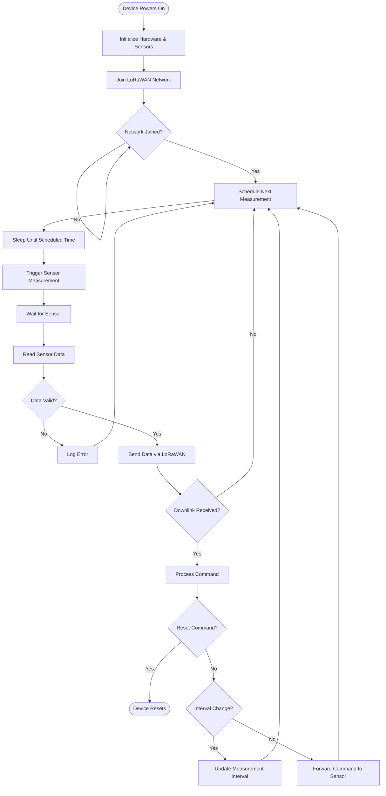

# Measurement Cycle Process Flow

**Audience**: Quick Start (Beginner-Friendly)
**Version**: 3.7.0
**Last Updated**: 2025-10-30

This diagram shows how the Multiflexmeter collects and sends sensor data through a complete measurement cycle.

## Key Points

- **Measurement interval**: Configurable 20-4270 seconds (see [00-reference.md](00-reference.md#timing-constants))
- **Power management**: Device sleeps between measurements to save battery
- **Downlink commands**: See [00-reference.md](00-reference.md#lorawan-downlink-network--device) for complete list

## Related Diagrams

- **Next**: [Device States](02-device-states.md) - Understand device lifecycle
- **Technical**: [Communication Sequence](03-communication-sequence.md) - Detailed timing and protocols
- **Reference**: [Technical Reference](00-reference.md) - All specifications and constants
