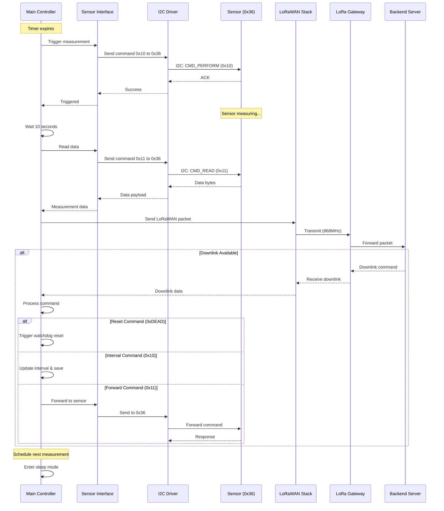

# Communication Sequence

**Audience**: Technical Reference (Developer-Focused)
**Version**: 3.7.0
**Last Updated**: 2025-10-30

This diagram shows the detailed timing and interactions between components during a typical measurement cycle.

## Timing Details

For complete timing specifications, see [00-reference.md](00-reference.md#timing-constants).

Key timings in this sequence:
- **I2C Transaction**: ~1ms per command/response
- **Sensor Measurement Wait**: 10 seconds between trigger and read
- **LoRaWAN TX**: 200-500ms (spreading factor dependent)
- **RX Windows**: RX1 at +1s, RX2 at +2s after transmission

## Protocol Details

For complete protocol specifications, see:
- **I2C Commands**: [00-reference.md](00-reference.md#i2c-commands-to-sensor-at-0x36)
- **LoRaWAN Uplinks**: [00-reference.md](00-reference.md#lorawan-uplink-device--network)
- **LoRaWAN Downlinks**: [00-reference.md](00-reference.md#lorawan-downlink-network--device)

## Related Diagrams

- **Overview**: [Measurement Cycle](01-measurement-cycle.md) - High-level process flow
- **Architecture**: [System Architecture](04-system-architecture.md) - Component relationships
- **Advanced**: [Data Flow](05-data-flow.md) - End-to-end data journey
- **Reference**: [Technical Reference](00-reference.md) - Complete protocol reference
