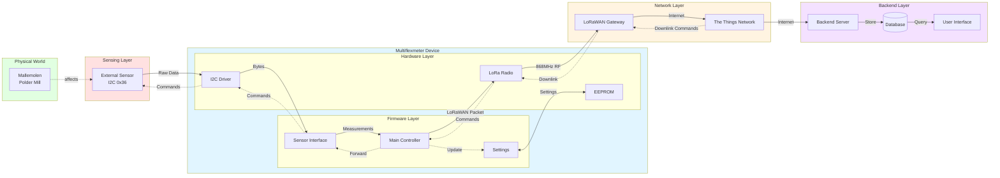
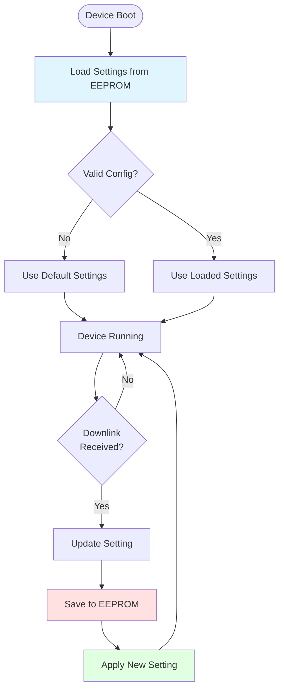

# Data Flow Diagram

**Audience**: Advanced Topics (Deep Dives)
**Version**: 3.7.0
**Last Updated**: 2025-10-30

This diagram shows the complete end-to-end journey of data through the Multiflexmeter system, from physical sensing to backend storage.

## Data Format at Each Stage

For complete protocol specifications, see [00-reference.md](00-reference.md).

### 1. Sensor → Device (I2C)
- **Trigger**: `0x10` → ACK only
- **Read**: `0x11` → Data bytes

### 2. Device → Network (LoRaWAN)
- **Port 1**: Sensor measurement data
- **Port 2**: Version information (on boot)

### 3. Network → Backend (IP)
TTN forwards LoRaWAN packets as JSON with metadata (RSSI, SNR, timestamp, etc.)

### 4. Backend Commands → Device
- **Reset**: `0xDEAD`
- **Set Interval**: `0x10 [MSB] [LSB]`
- **Sensor Command**: `0x11 [data...]`

## Configuration Flow

## EEPROM Configuration

For complete EEPROM structure details, see [00-reference.md](00-reference.md#eeprom-configuration-structure).

**Storage**: 41 bytes starting at address 0x00
**Key Fields**:
- LoRaWAN credentials (APP_EUI, DEV_EUI, APP_KEY)
- Measurement interval (20-4270 seconds)
- Hardware/firmware version
- TTN fair use policy flag

**Persistence**: All settings survive resets and power cycles.

## Related Diagrams

- **Architecture**: [System Architecture](04-system-architecture.md) - Component overview
- **Technical**: [Communication Sequence](03-communication-sequence.md) - Detailed interactions
- **Reference**: [Technical Reference](00-reference.md) - Complete data format specifications
