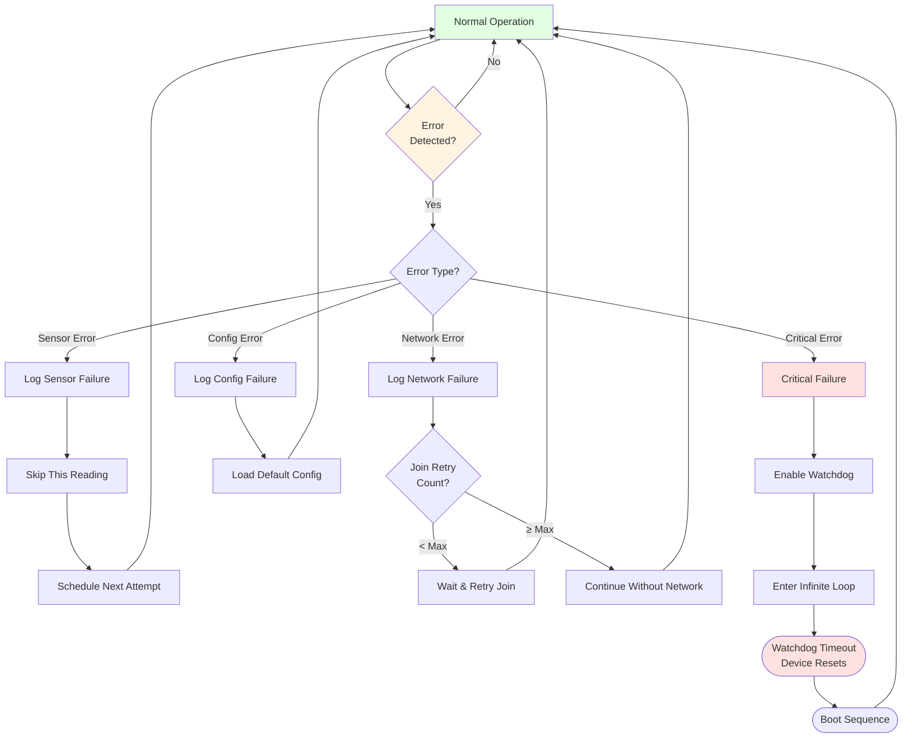
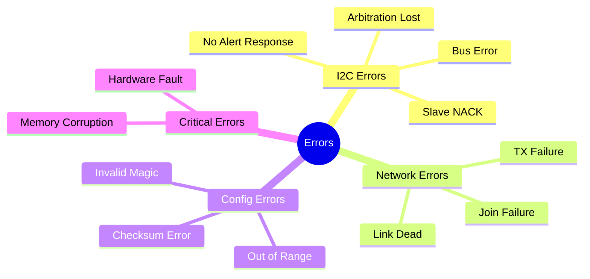
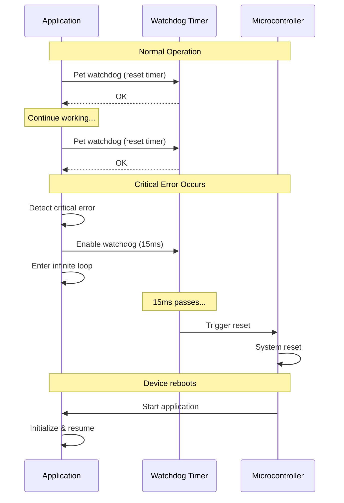

# Error Handling and Recovery

**Audience**: Advanced Topics (Deep Dives)
**Version**: 3.7.0
**Last Updated**: 2025-10-30

This diagram shows how the device detects, classifies, and recovers from various error conditions to maintain reliable operation.



## Error Types



## Error Recovery Strategies

For complete error code definitions, see [00-reference.md](00-reference.md#error-codes).

| Error Type | Detection Method | Recovery Strategy | Impact |
|------------|------------------|-------------------|--------|
| **Sensor NACK** | I2C ACK missing | Skip measurement, retry next cycle | 1 reading lost |
| **Sensor Timeout** | No response | Skip measurement, retry next cycle | 1 reading lost |
| **Join Failure** | OTAA timeout | Retry with backoff (max 10×) | Delayed start |
| **TX Failure** | Transmission error | Retry next cycle | 1 transmission lost |
| **Link Dead** | No network response | Continue measuring, rejoin | Data not sent |
| **Config Invalid** | Magic bytes mismatch | Load defaults | Settings lost |
| **Memory Corrupt** | EEPROM error | Watchdog reset | Device restarts |
| **Critical Fault** | Unrecoverable | Watchdog reset | Device restarts |

## Watchdog Timer



## Error Logging

When DEBUG mode is enabled, errors are logged to serial output:
```
[timestamp] ERROR: Sensor NACK on address 0x36
[timestamp] Retrying measurement in next cycle
```

## Recovery Times

See [00-reference.md](00-reference.md#timing-constants) for complete timing details.

- **Sensor Error**: Immediate (skip to next cycle)
- **Join Failure**: 10-60s per retry attempt
- **Config Error**: <1s (load defaults)
- **Watchdog Reset**: 2-5s (full reboot)

## Best Practices

1. **Validate data** before transmission
2. **Retry with backoff** for transient errors
3. **Use watchdog** as last resort only
4. **Enable logging** for debugging
5. **Fail gracefully** - maintain operation when possible

## Related Diagrams

- **States**: [Device States](02-device-states.md) - State transitions and error state
- **Technical**: [Communication Sequence](03-communication-sequence.md) - Where errors can occur
- **Reference**: [Technical Reference](00-reference.md) - Complete error code reference
