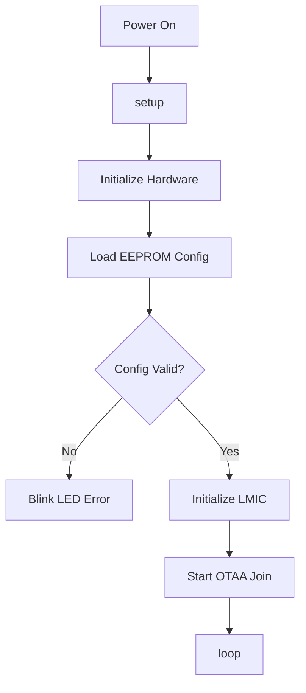
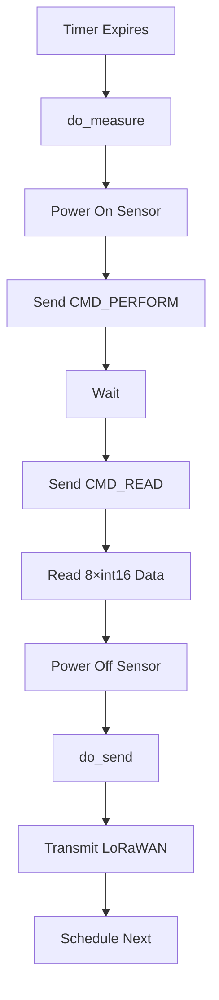
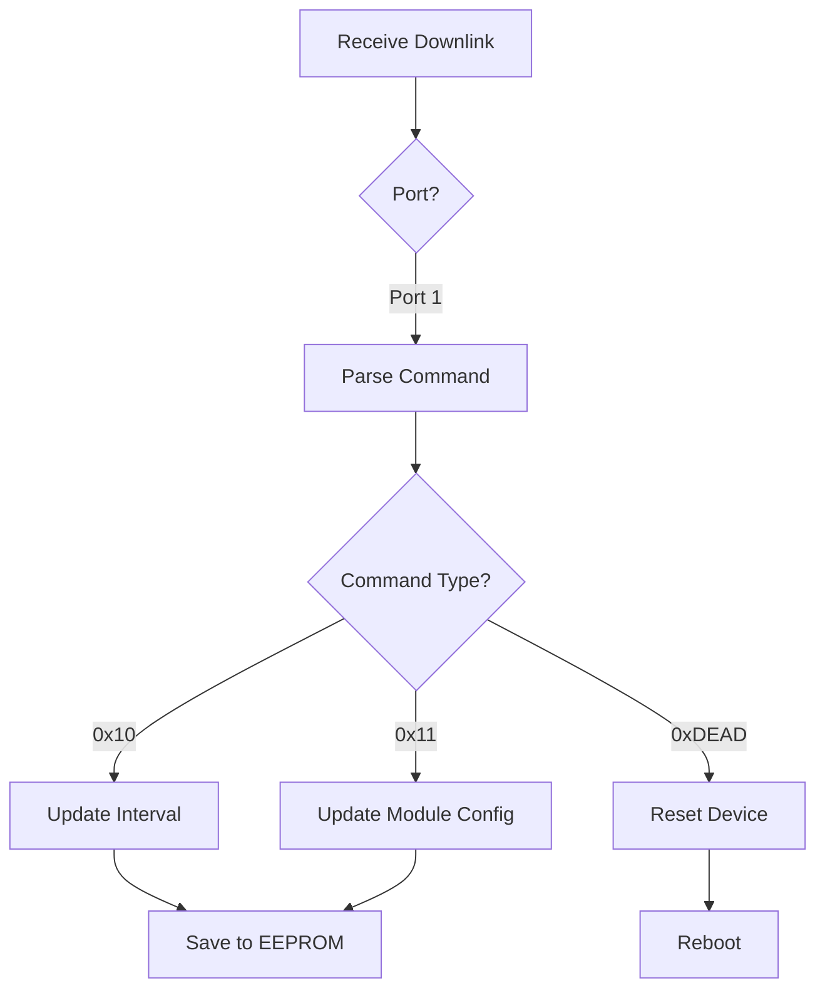

# Firmware Architecture

Software architecture and code organization for the Multiflexmeter V3 firmware.

## Architecture Overview

The firmware follows an event-driven architecture using the Arduino-LMIC library's job scheduler:

```
┌──────────────────────────────────────────┐
│         Application Layer                │
│  (main.cpp - Event Handlers)            │
└────────┬─────────────────────────┬───────┘
         │                         │
┌────────▼─────────┐    ┌──────────▼────────┐
│  Sensor Layer    │    │  LoRaWAN Layer    │
│  (sensors.cpp)   │    │  (LMIC)           │
└────────┬─────────┘    └──────────┬────────┘
         │                         │
┌────────▼─────────┐    ┌──────────▼────────┐
│  SMBus Layer     │    │  Radio Layer      │
│  (smbus.cpp)     │    │  (RFM95)          │
└──────────────────┘    └───────────────────┘
         │                         │
┌────────▼─────────────────────────▼────────┐
│         Hardware Abstraction Layer        │
│       (board_config, board.cpp)           │
└───────────────────────────────────────────┘
```

## Core Components

### 1. Main Application (`main.cpp`)

Event-driven main loop handling:

```cpp
void setup() {
    // Initialize hardware
    // Configure LMIC
    // Read EEPROM config
    // Schedule first measurement
}

void loop() {
    // Job scheduler
    os_runloop_once();
    
    // Optional: sleep mode
    Watchdog.sleep();
}
```

**Key Functions:**
- `EV_TXCOMPLETE` - Transmission complete handler
- `EV_JOINING` - OTAA join in progress
- `EV_JOINED` - OTAA join successful
- `do_send()` - Send uplink message
- `do_measure()` - Trigger sensor reading
- `onEvent()` - LMIC event handler

### 2. Sensor Interface (`sensors.cpp`, `smbus.cpp`)

**SMBus Communication:**
```cpp
// High-level sensor API
uint8_t sensorPerform(uint8_t sensor_address);
uint8_t sensorRead(uint8_t sensor_address, int16_t* data);

// Low-level SMBus protocol
smBusInit();
smBusWriteByte(address, command);
smBusReadWord(address, command);
```

**Command Flow:**
1. Send `CMD_PERFORM` (0x10) to trigger measurement
2. Wait (sensor processing time)
3. Send `CMD_READ` (0x11) to retrieve data
4. Parse response (8 × int16 values)

### 3. Configuration (`rom_conf.cpp`, `config.h`)

**EEPROM Management:**
```cpp
// Structure in EEPROM
typedef struct {
    uint8_t magic[4];          // "MFM\0"
    uint8_t hw_version[2];     // Hardware version
    uint8_t appeui[8];         // Application EUI
    uint8_t deveui[8];         // Device EUI
    uint8_t appkey[16];        // Application Key
    uint8_t interval[2];       // Measurement interval (seconds)
    uint8_t fair_use;          // Fair Use Policy compliance
} rom_conf_t;
```

**Configuration Functions:**
- `rom_conf_init()` - Load config from EEPROM
- `rom_conf_is_valid()` - Validate magic bytes
- `rom_conf_get_version()` - Get firmware version

**Compile-Time Configuration** (`config.h`):
```cpp
#define MIN_INTERVAL 20        // Minimum interval (seconds)
#define MAX_INTERVAL 4270      // Maximum interval (seconds)
#define SENSOR_ADDRESS 0x36    // I²C address
```

### 4. Watchdog Timer (`wdt.cpp`)

- Watchdog for crash recovery
- Uses Adafruit SleepyDog library
- Automatically resets on hang

### 5. Board Support (`boards/`)

Board-specific implementations:
```cpp
// mfm_v3_m1284p.cpp
void board_init();              // Initialize hardware
void board_sleep();             // Enter sleep mode
void board_sensor_power(bool);  // Control sensor power
```

## Event Flow

### Power-On Sequence



### Measurement Cycle



### Downlink Handling



## Memory Layout

### Flash (128KB)
- **Bootloader**: 512 bytes
- **Application**: ~50-60KB (depends on features)
- **LMIC Library**: ~30KB
- **Arduino Core**: ~20KB
- **Free**: ~20-30KB

### SRAM (16KB)
- **Stack**: ~2KB
- **Heap**: ~8KB
- **LMIC Buffers**: ~4KB
- **Global Variables**: ~2KB

### EEPROM (4KB)
- **Configuration**: 41 bytes
- **Free**: 4055 bytes (available for extensions)

## Design Patterns

### 1. Event-Driven Architecture
- Uses LMIC job scheduler
- Non-blocking operations
- Callback-based event handling

### 2. Hardware Abstraction
- Board-specific code in `boards/` directory
- Conditional compilation for variants
- Easy to port to new hardware

### 3. Configuration Management
- Persistent storage in EEPROM
- Runtime validation
- Default fallback values

### 4. Power Management
- Sleep mode between measurements
- Peripheral power control
- Watchdog for reliability

## Build System Integration

### Conditional Compilation

```cpp
#if BOARD == BOARD_MFM_V3_M1284P
    // ATmega1284P-specific code
#endif

#ifdef DEBUG
    // Debug logging
#endif
```

### Optimization Flags

From `platformio.ini`:
```ini
build_flags = 
    -Os                    # Optimize for size
    -ffunction-sections    # Dead code elimination
    -fdata-sections
    -flto                  # Link-time optimization
```

## Extending the Firmware

### Adding New Sensor Types

1. Define sensor commands in `sensors.h`
2. Implement sensor driver in `sensors.cpp`
3. Add sensor selection in `config.h`
4. Update measurement loop in `main.cpp`

### Adding New Downlink Commands

1. Define command code in `main.cpp`
2. Implement handler in `onEvent()` → `EV_TXCOMPLETE`
3. Update payload decoder in TTN
4. Document in protocol specification

### Adding New Board Variants

1. Create new board config in `include/board_config/`
2. Create board implementation in `src/boards/`
3. Add board definition to `platformio.ini`
4. Update `board.h` with new board ID

## Next Steps

- [Development Guide](/development/development-guide/) - Build and modify firmware
- [API Reference](/firmware/api-reference/) - Function documentation
- [Build System](/firmware/build-system/) - PlatformIO configuration
