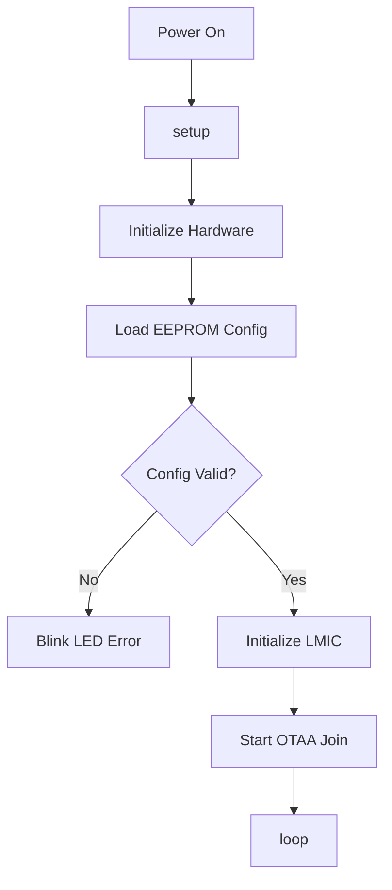
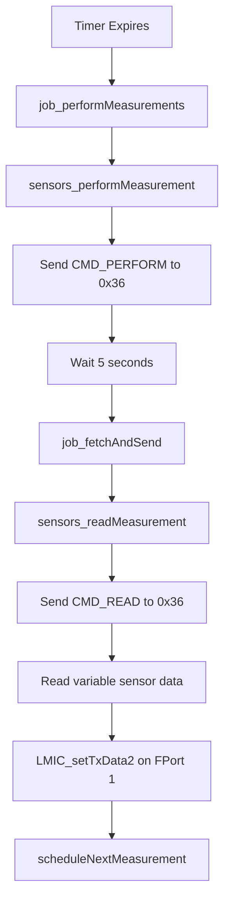
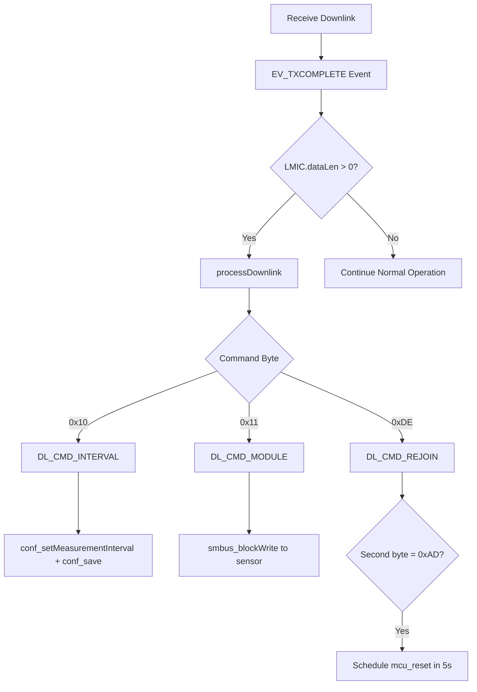

# Firmware Architecture

Software architecture and code organization for the Multiflexmeter V3.7.0 firmware.

## Architecture Overview

The firmware follows an event-driven architecture using the Arduino-LMIC library's job scheduler:

```
┌──────────────────────────────────────────┐
│         Application Layer                │
│  (main.cpp - Event Handlers)            │
└────────┬─────────────────────────┬───────┘
         │                         │
┌────────▼─────────┐    ┌──────────▼────────┐
│  Sensor Layer    │    │  LoRaWAN Layer    │
│  (sensors.cpp)   │    │  (LMIC)           │
└────────┬─────────┘    └──────────┬────────┘
         │                         │
┌────────▼─────────┐    ┌──────────▼────────┐
│  SMBus Layer     │    │  Radio Layer      │
│  (smbus.cpp)     │    │  (RFM95)          │
└──────────────────┘    └───────────────────┘
         │                         │
┌────────▼─────────────────────────▼────────┐
│         Hardware Abstraction Layer        │
│       (board_config, board.cpp)           │
└───────────────────────────────────────────┘
```

## Core Components

### 1. Main Application (`main.cpp`)

Event-driven main loop handling:

```cpp
void setup() {
    // Initialize hardware
    // Configure LMIC
    // Read EEPROM config
    // Schedule first measurement
}

void loop() {
    // Job scheduler
    os_runloop_once();
    
    // Optional: sleep mode
    Watchdog.sleep();
}
```

**Key Functions:**
- `onEvent()` - LMIC event handler for join/TX/RX events
- `job_performMeasurements()` - Trigger sensor measurement
- `job_fetchAndSend()` - Read sensor data and transmit
- `job_pingVersion()` - Send version information
- `job_reset()` - Device reset handler
- `scheduleNextMeasurement()` - Schedule next measurement cycle
- `processDownlink()` - Handle received commands

### 2. Sensor Interface (`sensors.cpp`, `smbus.cpp`)

**SMBus Communication:**
```cpp
// High-level sensor API
error_t sensors_init(void);
error_t sensors_performMeasurement(void);
error_t sensors_readMeasurement(uint8_t *buf, uint8_t *length);

// Low-level SMBus protocol
error_t smbus_init(void);
error_t smbus_sendByte(uint8_t addr, uint8_t byte);
error_t smbus_blockRead(uint8_t addr, uint8_t cmd, 
                        uint8_t *rx_buf, uint8_t *rx_length);
error_t smbus_blockWrite(uint8_t addr, uint8_t cmd,
                         uint8_t *tx_buf, uint8_t tx_length);
```

**Command Flow:**
1. Send `CMD_PERFORM` (0x10) to sensor address 0x36
2. Wait 5 seconds (`MEASUREMENT_SEND_DELAY_AFTER_PERFORM_S`)
3. Send `CMD_READ` (0x11) to retrieve raw sensor data
4. Transmit variable-length response (up to 32 bytes)

### 3. Configuration (`rom_conf.cpp`, `config.h`)

**EEPROM Management:**
```cpp
// Structure in EEPROM
struct __attribute__((packed)) rom_conf_t {
    uint8_t MAGIC[4];               // "MFM\0"
    struct {
        uint8_t MSB;                // Hardware version MSB
        uint8_t LSB;                // Hardware version LSB
    } HW_VERSION;                   // Hardware version (2 bytes)
    uint8_t APP_EUI[8];             // Application EUI
    uint8_t DEV_EUI[8];             // Device EUI
    uint8_t APP_KEY[16];            // Application Key
    uint16_t MEASUREMENT_INTERVAL;  // Measurement interval (seconds)
    uint8_t USE_TTN_FAIR_USE_POLICY; // Fair Use Policy compliance
};
```

**Error Handling:**
```cpp
typedef enum {
  ERR_NONE,                 // No error
  ERR_SMBUS_SLAVE_NACK,     // Slave did not acknowledge
  ERR_SMBUS_ARB_LOST,       // Bus arbitration lost
  ERR_SMBUS_NO_ALERT,       // No alert pending
  ERR_SMBUS_ERR,            // General SMBus error
} error_t;
```
    uint16_t MEASUREMENT_INTERVAL;  // Measurement interval (seconds)
    uint8_t USE_TTN_FAIR_USE_POLICY; // Fair Use Policy compliance
};
```

**Configuration Functions:**
- `conf_load()` - Load config from EEPROM
- `conf_save()` - Save config to EEPROM  
- `conf_getMeasurementInterval()` - Get measurement interval with bounds checking
- `conf_setMeasurementInterval()` - Set measurement interval
- `conf_getAppEui()`, `conf_getDevEui()`, `conf_getAppKey()` - LoRaWAN credentials
- `conf_getFirmwareVersion()`, `conf_getHardwareVersion()` - Version info
- `versionToUint16()` - Convert version struct to uint16

**Compile-Time Configuration** (`config.h`):
```cpp
#define MIN_INTERVAL 20        // Minimum interval (seconds)
#define MAX_INTERVAL 4270      // Maximum interval (seconds)
#define SENSOR_ADDRESS 0x36    // I²C address
```

### 4. Watchdog Timer (`wdt.cpp`)

Custom watchdog implementation for device reset functionality:
```cpp
void mcu_reset(void);  // Force MCU reset via watchdog
```

- Uses AVR watchdog timer directly
- 15ms timeout for reset
- Used by downlink reset command (0xDEAD)

:::note[Library Dependencies]
While `Adafruit SleepyDog Library@^1.4.0` is included in `platformio.ini`, the firmware uses the custom `wdt.cpp` implementation for reset functionality. The Adafruit library is not actively used in the code.
:::

### 5. Board Support (`boards/`)

Board-specific implementations for hardware variants:
```cpp
// mfm_v3_m1284p.cpp / mfm_v3.cpp
void board_setup(void);        // Initialize board-specific settings
```

**Pin Definitions** (`include/board_config/`):
- `mfm_v3_m1284p.h` - ATmega1284P pin mappings
- `mfm_v3.h` - ATmega328P pin mappings (legacy)

**Board Selection** via PlatformIO build flags:
- `-DBOARD_MFM_V3_M1284P` for current boards
- `-DBOARD_MFM_V3` for legacy boards

## Event Flow

### Power-On Sequence



### Measurement Cycle



### Downlink Handling



## Memory Layout

### Flash (128KB)
- **Bootloader**: 512 bytes
- **Application**: ~50-60KB (depends on features)
- **LMIC Library**: ~30KB
- **Arduino Core**: ~20KB
- **Free**: ~20-30KB

### SRAM (16KB)
- **Stack**: ~2KB
- **Heap**: ~8KB
- **LMIC Buffers**: ~4KB
- **Global Variables**: ~2KB

### EEPROM (4KB)
- **Configuration**: 41 bytes
- **Free**: 4055 bytes (available for extensions)

## Design Patterns

### 1. Event-Driven Architecture
- Uses LMIC job scheduler
- Non-blocking operations
- Callback-based event handling

### 2. Hardware Abstraction
- Board-specific code in `boards/` directory
- Conditional compilation for variants
- Easy to port to new hardware

### 3. Configuration Management
- Persistent storage in EEPROM
- Runtime validation
- Default fallback values

### 4. Power Management
- **LMIC-based power control**: Uses `os_runloop_once()` for efficient sleep/wake cycles
- **Custom reset functionality**: Custom `wdt.cpp` for controlled device resets
- **Peripheral power control**: Pin-based sensor power management
- **Low-power operation**: Event-driven design minimizes active time

:::note[Power Management Libraries]
The firmware uses LMIC's built-in power management rather than external sleep libraries. While `Adafruit SleepyDog Library` is listed as a dependency, it's not actively used in the current implementation.
:::

## Build System Integration

### Conditional Compilation

```cpp
#if BOARD == BOARD_MFM_V3_M1284P
    // ATmega1284P-specific code
#endif

#ifdef DEBUG
    // Debug logging
#endif
```

### Optimization Flags

From `platformio.ini`:
```ini
build_flags = 
    -Os                    # Optimize for size
    -ffunction-sections    # Dead code elimination
    -fdata-sections
    -flto                  # Link-time optimization
```

## Extending the Firmware

### Adding New Sensor Types

1. Define sensor commands in `sensors.h`
2. Implement sensor driver in `sensors.cpp`
3. Add sensor selection in `config.h`
4. Update measurement loop in `main.cpp`

### Adding New Downlink Commands

1. Define command code in `main.cpp`
2. Implement handler in `onEvent()` → `EV_TXCOMPLETE`
3. Update payload decoder in TTN
4. Document in protocol specification

### Adding New Board Variants

1. Create new board config in `include/board_config/`
2. Create board implementation in `src/boards/`
3. Add board definition to `platformio.ini`
4. Update `board.h` with new board ID

## Next Steps

- [Development Guide](/development/development-guide/) - Build and modify firmware
- [API Reference](/firmware/api-reference/) - Function documentation
- [Build System](/firmware/build-system/) - PlatformIO configuration
