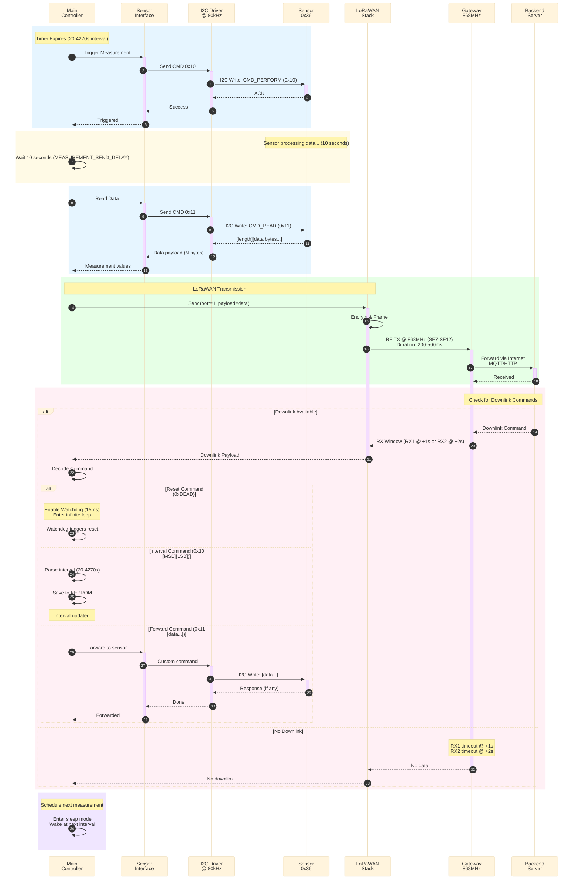

This diagram shows how components interact during a typical measurement cycle.

## Timing Details

- **I2C Communication**: ~1ms per transaction (80kHz bus speed)
- **Sensor Measurement Wait**: 10 seconds (MEASUREMENT_SEND_DELAY_AFTER_PERFORM_S)
- **LoRaWAN Transmission**: 200-500ms (depends on spreading factor)
- **LoRaWAN Receive Windows**: RX1 at 1s, RX2 at 2s after TX
- **Sleep Duration**: User-configurable (20s - 4270s)

## Protocol Details

### I2C Commands to Sensor (0x36)
- `0x10` (CMD_PERFORM): Trigger new measurement
- `0x11` (CMD_READ): Read measurement results

### LoRaWAN Downlink Commands
- `0xDEAD`: Reset device immediately
- `0x10 [MSB] [LSB]`: Set interval in seconds
- `0x11 [data...]`: Forward data to sensor module
