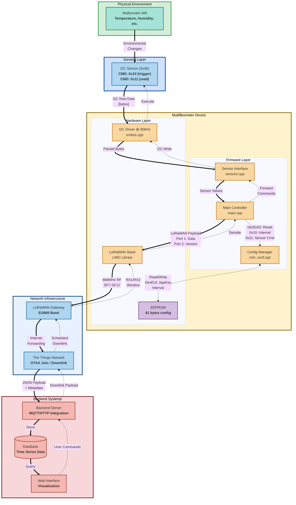
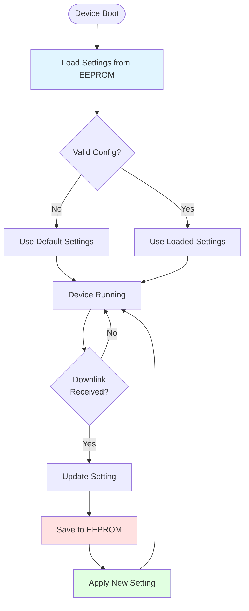

This diagram shows how data moves through the Multiflexmeter system.



## Data Format at Each Stage

### 1. Sensor → Device (I2C)
```
Command: 0x10 (trigger) → No response
Command: 0x11 (read) → [length][byte1][byte2]...[byteN]
```

### 2. Device → Network (LoRaWAN)
```
Port: 1 (sensor data)
Payload: [sensor_data_bytes]

Port: 2 (version ping)
Payload: [fw_version_msb][fw_version_lsb][hw_version_msb][hw_version_lsb]
```

### 3. Network → Backend (IP)
```json
{
  "device_id": "...",
  "timestamp": "...",
  "payload": "base64_encoded_data",
  "port": 1,
  "rssi": -120,
  "snr": 5.2
}
```

### 4. Backend Commands → Device
```
Reset: 0xDE 0xAD
Set Interval: 0x10 [interval_msb] [interval_lsb]
Sensor Command: 0x11 [command_bytes...]
```

## Configuration Flow



## Settings Stored in EEPROM (41 bytes)

| Offset | Size | Field | Description |
|--------|------|-------|-------------|
| 0-3 | 4 | MAGIC | "MFM\0" identifier |
| 4-5 | 2 | HW_VERSION | Hardware version |
| 6-13 | 8 | APP_EUI | LoRaWAN Application EUI |
| 14-21 | 8 | DEV_EUI | LoRaWAN Device EUI |
| 22-37 | 16 | APP_KEY | LoRaWAN Application Key |
| 38-39 | 2 | INTERVAL | Measurement interval (seconds) |
| 40 | 1 | TTN_POLICY | Use TTN fair use policy |

All settings persist across resets and power cycles.
