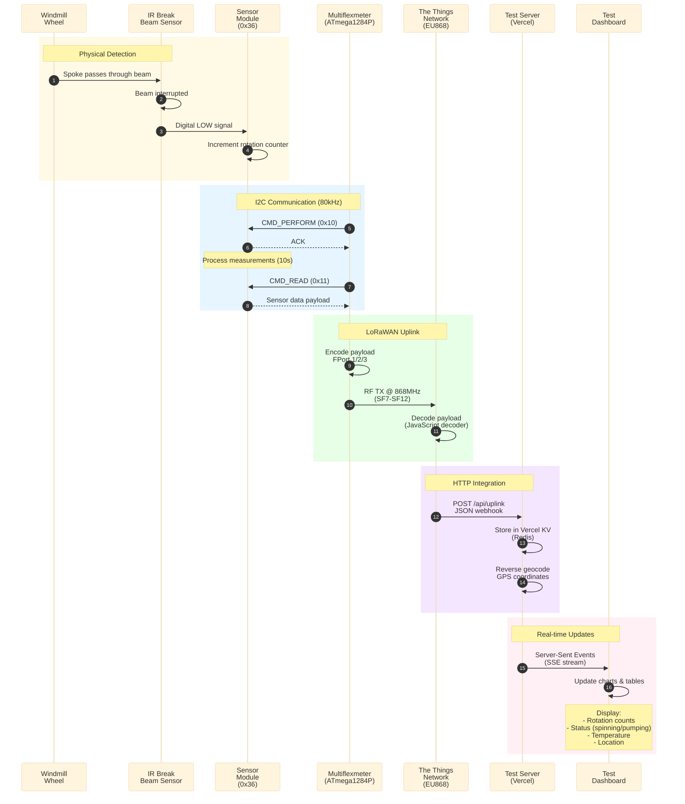
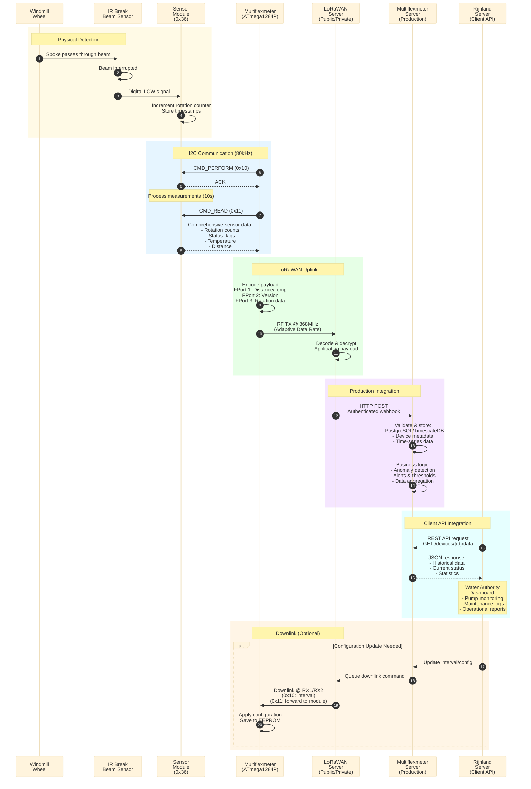

This diagram compares the complete data flow from physical rotation detection to data visualization in both Test and MVP (Production) environments.

## Test Environment Flow

## MVP Environment Flow

## Key Differences

### Test Environment
- **Purpose**: Development, testing, and demonstrations
- **Network**: The Things Network (Community/Free)
- **Backend**: Vercel serverless (Astro + Vercel KV)
- **Database**: Vercel KV (Redis) - ephemeral data
- **Features**:
  - Real-time SSE dashboard
  - Device simulator support
  - Rapid iteration
  - No authentication required
  - Geographic visualization (Nominatim)

### MVP Environment
- **Purpose**: Production deployment for water authorities
- **Network**: Dedicated LoRaWAN server (Public/Private)
- **Backend**: Production Multiflexmeter Server
- **Database**: PostgreSQL/TimescaleDB - persistent time-series data
- **Features**:
  - Enterprise authentication & authorization
  - SLA guarantees
  - Data retention policies
  - Advanced analytics & reporting
  - Integration with existing client systems (Rijnland)
  - Maintenance scheduling
  - Alert & notification system

## Payload Details

### FPort 1: Distance & Temperature
- **Bytes 0-1**: Distance (uint16 LE, mm)
- **Bytes 2-5**: Temperature (float32 LE, °C)
- **Use Case**: Water level monitoring

### FPort 2: Version Info
- **Bytes 0-1**: FW version (proto/major/minor/patch)
- **Bytes 2-3**: HW version (proto/major/minor/patch)
- **Use Case**: Device inventory, compatibility checks

### FPort 3: Rotation Data
- **Byte 0**: Status flags (spinning, pumping)
- **Bytes 1-4**: Total pumping rotations (uint32 LE)
- **Bytes 5-8**: Total spinning rotations (uint32 LE)
- **Use Case**: Primary operational monitoring

## Timing Characteristics

| Stage | Test Environment | MVP Environment |
|-------|-----------------|-----------------|
| **Measurement Interval** | 30s (configurable 20-4270s) | 300s typical (5 min) |
| **I2C Transaction** | ~1ms @ 80kHz | ~1ms @ 80kHz |
| **Sensor Processing** | 10 seconds | 10 seconds |
| **LoRaWAN TX** | 200-500ms (SF7-SF12) | ~200ms (ADR optimized) |
| **Backend Processing** | <100ms (serverless) | <50ms (dedicated) |
| **Dashboard Update** | Real-time (SSE) | Polling/WebSocket |

## Network Specifications

### LoRaWAN Configuration
- **Frequency**: EU868 (868.1 - 868.5 MHz)
- **Modulation**: LoRa CSS
- **Activation**: OTAA (Over-The-Air Activation)
- **Class**: Class A (lowest power)
- **Adaptive Data Rate**: Enabled in MVP, configurable in Test
- **Confirmed Uplinks**: Disabled (optimize battery life)
- **Duty Cycle**: <1% (EU regulations)

### Data Rate & Range Trade-off
- **SF7**: ~2 km range, 5.5 kbps, 200ms airtime
- **SF12**: ~15 km range, 250 bps, 1-2s airtime
- **Battery Life**: 2-5 years (depending on interval & SF)
