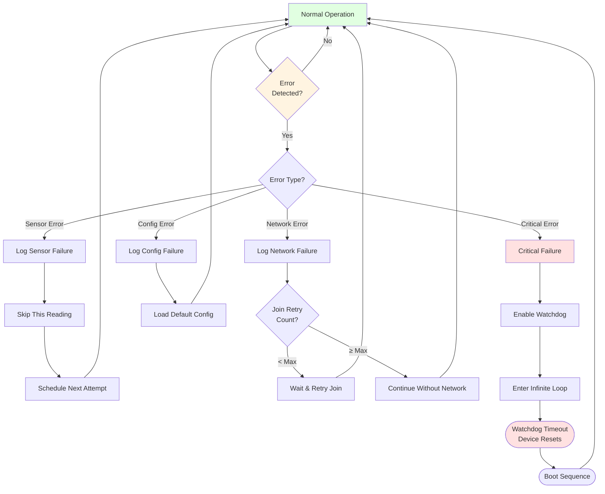
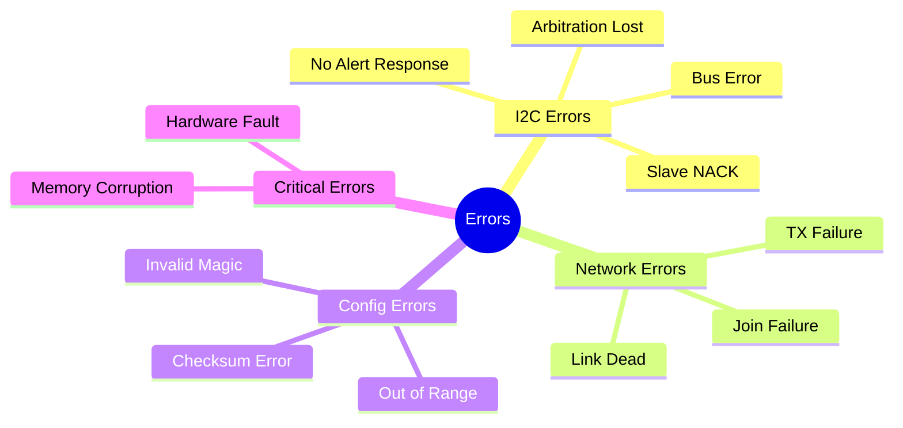
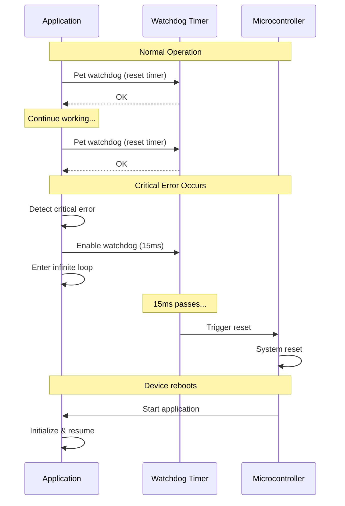

This diagram shows how the device handles errors and recovers from failures.



## Error Types



## Error Recovery Strategies

| Error Type | Detection | Recovery | Impact |
|------------|-----------|----------|--------|
| **Sensor NACK** | I2C transaction fails | Skip measurement, retry next cycle | One data point lost |
| **Sensor Timeout** | No response after trigger | Skip measurement, retry next cycle | One data point lost |
| **Join Failure** | OTAA join times out | Retry with backoff, max 10 attempts | Delayed operation |
| **TX Failure** | Transmission fails | Retry on next cycle | One transmission lost |
| **Link Dead** | No response from network | Continue measuring, attempt rejoin | Data buffering needed |
| **Config Invalid** | Magic bytes wrong | Use default settings | Settings lost |
| **Memory Corrupt** | Read/write errors | Watchdog reset | Device restarts |
| **Critical Fault** | Unrecoverable error | Watchdog reset | Device restarts |

## Watchdog Timer



## Error Logging

The device maintains an error counter for debugging:

```
Error Code | Count | Last Occurrence
-----------|-------|----------------
ERR_NONE   |   0   | -
SLAVE_NACK |   3   | 2024-10-30 14:23:15
ARB_LOST   |   0   | -
NO_ALERT   |   1   | 2024-10-30 12:45:30
SMBUS_ERR  |   0   | -
```

Errors are logged to serial output when DEBUG mode is enabled:
```
[12345] ERROR: Sensor NACK on address 0x36
[12348] Retrying measurement in next cycle
```

## Recovery Time Estimates

- **Sensor Error**: Immediate (skip to next cycle)
- **Network Join Failure**: 10-60 seconds per retry
- **Config Error**: <1 second (load defaults)
- **Watchdog Reset**: 2-5 seconds (full reboot)

## Best Practices

1. **Always validate** sensor data before transmission
2. **Retry with backoff** for transient errors
3. **Use watchdog** as last resort for critical failures
4. **Log errors** for debugging and maintenance
5. **Fail gracefully** - continue operation when possible
