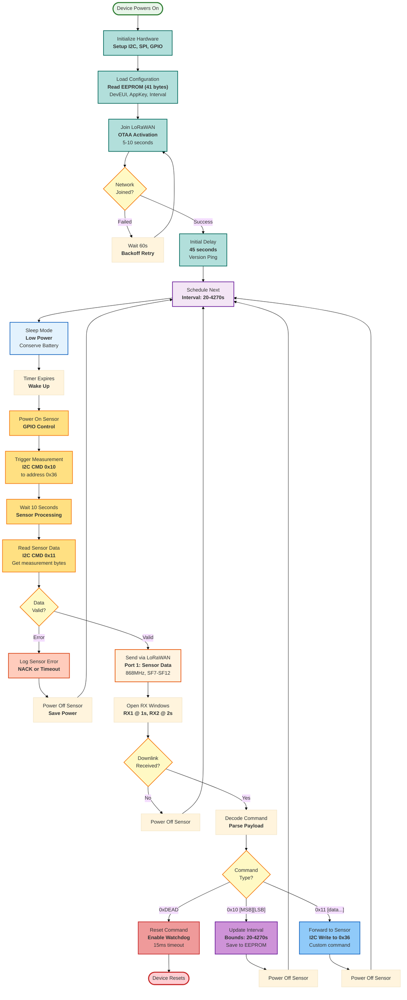

This diagram shows how the Multiflexmeter collects and sends sensor data.

## Key Points

- **Measurement interval**: Configurable between 20 seconds and 4270 seconds (~71 minutes)
- **Power management**: Device sleeps between measurements to save battery
- **Downlink commands**:
  - `0xDEAD`: Reset device
  - `0x10`: Change measurement interval
  - `0x11`: Forward command to sensor module
